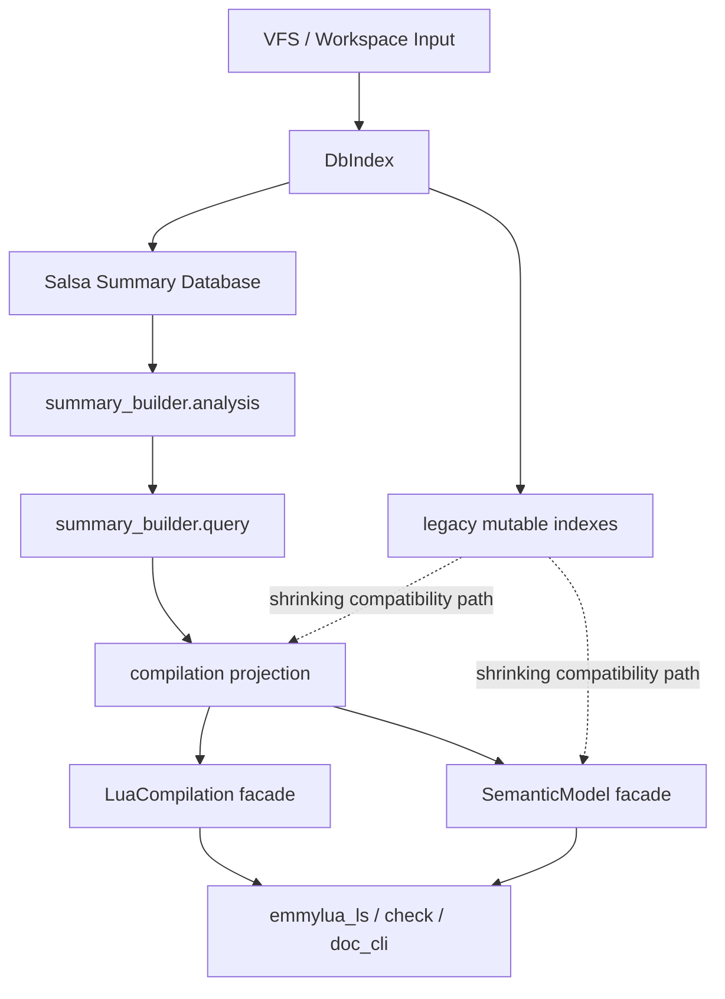

# Compilation / Semantic 架构现状与演进路线

## 目的

这份文档描述 `emmylua_code_analysis` 当前正在形成的架构、已经完成的迁移、仍然保留的 legacy 依赖、后续演进顺序，以及一个最关键的问题：

什么时候可以认为我们已经可以彻底替换掉 analyzer 语义。

这里的“替换 analyzer 语义”不是指删掉一个目录名，而是指：

1. 更新路径不再依赖 analyzer 作为语义事实写入中心。
2. 运行期查询不再依赖 analyzer-era 生成的权威状态才能得到正确答案。
3. 调用者可以通过稳定、集中、内聚的 facade 和 projection API 完成主要工作，而不是直接碰 `DbIndex` 的各类 legacy index。

## 当前架构总览



### 1. `DbIndex`

`DbIndex` 现在仍然是总容器，但目标已经不是“语义事实中心”，而是：

- VFS / workspace / config 的承载体。
- Salsa summary database 的挂载点。
- 少量仍未迁移读路径的兼容承载层。

当前它仍然暴露很多 legacy index：

- `type_index`
- `decl_index`
- `member_index`
- `signature_index`
- `operator_index`
- `reference_index`

这些 index 现在仍被大量 runtime semantic/type-check/query 代码直接访问，所以 `DbIndex` 还没有真正退化成“纯容器”。

### 2. `summary_builder.analysis`

这是 file-local fact layer。

它负责从单文件 AST / doc comment / syntax 中提取事实，不应该承担跨文件语义求值，也不应该继续为 analyzer compatibility 专门写一套平行状态。

这个层的理想产物包括：

- decl tree
- doc summaries
- doc type nodes
- signature summaries
- module export syntax facts
- lexical / flow / property 等局部事实

### 3. `summary_builder.query`

这是 derived query layer。

它的职责是把 file facts 组织成可复用的查询入口和索引结构，而不是让调用者反复扫描 summary 向量。

适合放在这里的东西：

- reverse index
- exact lookup
- graph summaries
- semantic target lookup
- module export resolve query
- signature / generic / owner 相关精确查询

### 4. `compilation`

`compilation` 现在是 migration projection layer，而不是新的 analyzer。

它的职责是：

- 把 summary/query 结果转换成现有调用方可接受的形状。
- 提供过渡期 facade 和 projection API。
- 吸收原来 scattered free-function helper 的聚合责任。

典型代表：

- `LuaCompilation`
- type generic metadata projection
- alias origin projection
- module projection / export projection
- decl / property / super type projection

### 5. `SemanticModel`

`SemanticModel` 是当前面向大部分 runtime consumer 的主入口。

它已经逐步形成了“对单文件语义查询的集中入口”角色，包括：

- module lookup
- module export type lookup
- member lookup
- expr inference
- semantic decl lookup
- type generic metadata facade

但它还没有覆盖所有热点查询。大量内部 semantic 子模块仍然直接读 `DbIndex` 的 legacy index。

### 6. `compilation::analyzer`

`compilation::analyzer` 还存在，而且内部仍然很大。

当前要点不是“它还在，所以架构没变”，而是要分清它剩下的责任：

- 一部分是确实还未迁移走的 update-time 语义写入逻辑。
- 一部分只是被历史路径引用的兼容实现。
- 一部分已经应该移动到 summary fact / query / projection，但还没完全搬完。

也就是说，现在 analyzer 已经不是方向，但它仍然是一个体积很大的历史负担。

## 当前已经完成的关键迁移

### 1. 更新路径已经不是“重跑 analyzer pipeline”主导

`LuaCompilation::update_index()` 当前做的是 summary sync：

- sync summary workspace
- sync summary file

这意味着更新主路径已经开始从“写 legacy index”转向“同步 fact layer”。

这是 analyzer 退场的第一个必要条件，而且已经具备雏形。

### 2. 类型泛型元数据已经有 summary-backed 单一真源

这一块已经完成了本轮最重要的一次收口：

- 新增了 type generic metadata projection。
- `LuaCompilation` / `SemanticModel` 已经有 facade 入口。
- alias origin detailed render 也已经接到 summary-backed projection。
- `emmylua_code_analysis/src` 下不再直接使用 `get_type_index().get_generic_params(...)`。

这件事意义很大，因为它证明了：

- legacy type metadata 可以被 compilation projection 稳定替代。
- summary-first 并不必然损失 runtime 语义质量。
- 一个领域可以先建立单一真源，再逐步迁移 consumer，而不需要中间兼容层横飞。

### 3. 模块查询入口已经开始集中

这轮迁移已经把模块相关读路径收拢成了三层：

- facade：`LuaCompilation` / `SemanticModel`
- internal query 聚合：`module_query`
- low-level implementation：`compilation::module`

已经迁走的内容包括：

- 外部 crate 对模块 lookup / export type 的直接 free-function 调用。
- semantic require/export 若干内部入口。
- member / infer_index / type_check 中的若干 `ModuleRef -> export type` 直读。

这说明“先聚合查询，再上提 facade”这条路是可行的。

### 4. facade API 正在成形，但 crate root 仍然过宽

`LuaCompilation` / `SemanticModel` 已经开始出现真实的集中入口，但 `lib.rs` 仍然在做几乎全量 re-export：

- `pub use compilation::*;`
- `pub use db_index::*;`
- `pub use diagnostic::*;`
- `pub use semantic::*;`
- `pub use vfs::*;`

这意味着架构方向已经对了，但 public surface 还没有真正收住。

### 5. member / decl alias/origin 投影层已建立，读路径开始迁移

本轮迁移 (2026-06-01) 完成了 member 领域的 alias/origin 投影和 consumer 迁移：

**新增 `compilation::member` 投影模块：**

- `get_type_def_kind` — 从 summary DB 查询类型定义的 kind (class/alias/enum/attribute)。
- `type_def_is_class` / `type_def_is_alias` — 对 kind 的便捷 boolean 查询。
- `type_def_alias_origin` — 从 summary DB 解析 alias 的原始类型，不需要 legacy `type_index`。

**consumer 迁移：**

- `semantic/member/find_index.rs` — `find_index_custom_type` / `find_index_generic` 的 alias 检查和 origin 解析迁移到 summary-backed 投影。
- `semantic/member/find_members.rs` — `find_custom_type_members` / `find_generic_members` 的 alias 检查和 origin 解析迁移到 summary-backed 投影。
- `find_generic_members` 删除了对 `type_index.get_type_decl().get_alias_origin()` 的依赖。

**已暴露的 projection API（供后续迁移复用）：**

- `pub(crate) infer_compilation_doc_type_key_with_owner` — 将 doc type key 转换为 `LuaType`，是其他投影的基础构建块。

**当前状态：**

- member 领域 alias/origin 路径已完全脱离 `type_index` 读。
- member/operator dispatch 和 member index 直接读取仍未迁移。
- 38 个 semantic 文件仍保留部分 legacy index 直读，见下一轮迁移计划。

这证明了“先建 projection，再迁 consumer，保留 legacy fallback”的模式可以逐领域推进。

### 6. 本轮迁移记录 (2026-06-01)

**已完成迁移：**

| # | 文件 | 迁移项 |
|---|---|---|
| 1 | `compilation/member.rs` (新增) | `get_type_def_kind`, `type_def_is_class`, `type_def_is_alias`, `type_def_alias_origin`, `type_def_is_enum` — summary-backed 类型查询投影 |
| 2 | `compilation/decl.rs` | `infer_compilation_doc_type_key_with_owner` 从 `fn` 提升为 `pub(crate)` |
| 3 | `semantic/member/find_index.rs` | alias/class 检查 → `type_def_is_alias` / `type_def_is_class` / `type_def_alias_origin`; 删除无用的 `type_decl` 变量 |
| 4 | `semantic/member/find_members.rs` | alias 检查 → `type_def_is_alias` / `type_def_alias_origin`; `find_generic_members` 的 alias origin 从 legacy 迁移 |
| 5 | `semantic/member/infer_raw_member.rs` | `infer_custom_type_raw_member_type`: alias/class/super → summary; `infer_generic_raw_member_type`: alias → summary |
| 6 | `semantic/type_check/simple_type.rs` | generic alias → summary; Ref enum check → `type_def_is_enum` |
| 7 | `semantic/type_check/func_type.rs` | generic alias → summary; custom type class check → `type_def_is_class` |
| 8 | `semantic/type_check/ref_type.rs` | 两处 `is_enum()` → `type_def_is_enum` (fast-fail) |
| 9 | `semantic/type_check/generic_type.rs` | 2 处 alias check + 3 处 super_types → summary-backed |
| 10 | `semantic/type_check/mod.rs` | `escape_type` alias check → summary |
| 11 | `semantic/type_check/complex_type/mod.rs` | generic alias → summary |
| 12 | `semantic/decl/mod.rs` | `enum_variable_is_param` is_enum → `type_def_is_enum` |
| 13 | `semantic/infer/infer_index/mod.rs` | 9 处迁移：4× alias/origin, 2× class/is_enum, 1× super_types, 1× namespace exists → `get_type_def_kind`, 1× `is_enum_key` 保留 legacy fallback |

**迁移模式总结：**

本轮迁移建立了一个可复用的模式：
1. 为语义领域在 `compilation` 层添加 summary-backed 投影函数（`pub(crate)`）。
2. 语义 consumer 优先使用投影函数，保留 legacy fallback 作为兼容路径。
3. 名称从冗长的 `find_compilation_type_def_*` 简化为 `type_def_*` / `get_type_def_*`。

**Phase 1 剩余工作（alias/origin/class/enum 域基本完成）：**

- `semantic/infer/infer_name.rs` — `decl_index` 直读（可迁到 `CompilationDeclTree`）
- `semantic/infer/infer_table.rs` — `type_index` / `decl_index`（alias/origin 可迁）
- `semantic/generic/instantiate_type/` — `type_index` / `signature_index` mixed access

### Phase 1 总结 (2026-06-01)

本轮共迁移 **15 个文件**，涉及 **30+ 处 legacy index 读替换**：

- **member 域**：`find_index.rs`、`find_members.rs`、`infer_raw_member.rs` — alias/origin/class → summary-backed
- **type_check 域**：`simple_type.rs`、`func_type.rs`、`ref_type.rs`、`generic_type.rs`、`mod.rs`、`complex_type/mod.rs` — alias/origin/class/enum/super_types → summary-backed
- **infer 域**：`infer_index/mod.rs` — 9 处 alias/origin/class/enum/super_types → summary-backed
- **decl 域**：`decl/mod.rs` — is_enum → summary-backed
- **generic 域**：`instantiate_type/mod.rs`、`instantiate_conditional_generic.rs` — alias/origin → summary-backed

**新建 `compilation::member` 投影模块**：
- `get_type_def_kind`、`type_def_is_class`、`type_def_is_alias`、`type_def_is_enum`、`type_def_alias_origin`

**遗留的 Phase 1 边缘（需 Phase 2 基元）：**
- `signature_index` → 需要 signature query projection
- `member_index.get_member_item()` → 需要 member query projection
- `type_index.get_type_cache()` → 需要 type cache projection
- `operator_index` → 需要 operator query projection
- `decl_index.get_decl()` → 需要 LuaDecl 适配层

**下一阶段不应该是**：继续盲目替换剩余的 `is_alias()` / `is_class()` / `is_enum()` 调用点。这些剩余的调用点通常需要 `get_alias_ref()`、`get_enum_field_type()`、`is_enum_key()` 等 legacy 方法，只替换 kind check 没有实质性收益（会变成 fast-fail + 仍加载 legacy 的双重调用）。

## Phase 2 铺垫（基于审核结果）
- `semantic/infer/infer_call/mod.rs` — `operator_index`（暂无 summary 替代）
- `semantic/infer/narrow/` — `type_index` / `decl_index` mixed access

## 当前最核心的结构性问题

### 问题 1：运行期 semantic 仍然大量直接读取 legacy index

目前最重的未完成问题不是 module path，也不是 generic metadata，而是：

`semantic/**/*` 下仍然存在大量直接访问：

- `db.get_type_index()`
- `db.get_member_index()`
- `db.get_decl_index()`
- `db.get_signature_index()`
- `db.get_operator_index()`

这说明许多 runtime 语义仍然默认 legacy mutable indexes 是权威来源。

只要这件事还成立，就不能说 analyzer 语义已经被彻底替换。

### 问题 2：crate root 对外导出面过宽

当前外部 crate 对 `emmylua_code_analysis` 的使用非常广，直接 import 了很多分散类型和函数：

- `emmylua_ls`
- `emmylua_check`
- `emmylua_doc_cli`

这意味着现在不能直接砍 root re-export，否则会演变成一次大规模外部 API 破坏。

所以 public API 收口必须分阶段完成，而不是“一刀切隐藏一切”。

### 问题 3：analyzer 目录剩余责任还没有被清单化拆分

目前 analyzer 中还混着几类完全不同的东西：

- 真正还没有迁出去的 update-time 语义逻辑。
- 只剩兼容意义的旧实现。
- 本应进入 summary_builder.analysis 的 file-local 提取。
- 本应进入 summary_builder.query 的索引/查询。
- 本应进入 compilation projection 的适配逻辑。

如果不先把这些责任拆清楚，就会很难判断“什么时候 analyzer 可以删”。

## 未来推荐的演化路线

下面这条路线不是抽象路线，而是按当前代码状态排序之后的可执行顺序。

## 第一阶段：继续收读路径，不扩 public breakage

目标：

- 继续减少 `semantic` 对 legacy index 的直接依赖。
- 优先迁移热点读路径到 `summary/query -> compilation projection -> SemanticModel`。
- 尽量不制造外部 crate 的 API break。

优先级建议：

1. generic / type-check / infer / member 的高频读路径。
2. signature / operator / super type / member ownership 等已有 summary/query 雏形的领域。
3. 只在最后处理低频、难迁移的小角落。

这一阶段的原则：

- 不强行一开始就删 `DbIndex` API。
- 先把 consumer 收拢到 facade 或 projection。
- 只有当调用面明显缩小后，再考虑收紧 public surface。

## 第二阶段：把 analyzer 剩余责任按归属拆掉

目标：

- 明确 analyzer 中每个子模块应该迁向哪里。

拆分原则：

- file-local AST/doc 事实提取 -> `summary_builder.analysis`
- indexed / derived / graph / reverse lookup -> `summary_builder.query`
- 调用方兼容形状 -> `compilation`
- 单文件 runtime 查询 -> `SemanticModel`
- 真正只剩历史兼容的部分 -> 直接删除

### Analyzer 责任清单（10,534 行，35 文件）

#### 1. `analyzer/doc/` — doc 注释分析（~3,200 行）

| 文件 | 行 | 责任 | 迁移目标 | 说明 |
|---|---|---|---|---|
| `infer_type.rs` | 1066 | 从 doc 类型节点推断 LuaType | `summary_builder.analysis` | 已有 `infer_doc_type` / `DocTypeInferContext` 替代 |
| `type_ref_tags.rs` | 523 | 处理 `@type` 引用标签 | `summary_builder.analysis` | 已有 `tracked/doc.rs` 对应 |
| `type_def_tags.rs` | 483 | 处理 `@class`/`@enum`/`@alias` 定义 | `summary_builder.analysis` | 已有 `tracked/doc.rs` 对应 |
| `tags.rs` | 263 | 通用标签分发 | `summary_builder.analysis` | dispatch → 各 tag handler |
| `field_or_operator_def_tags.rs` | 234 | `@field`/`@operator` 处理 | `summary_builder.analysis` | 已有替代 |
| `file_generic_index.rs` | 226 | 文件级泛型索引 | `summary_builder.query` | 索引/查询层 |
| `attribute_tags.rs` | 222 | `@attribute` 处理 | `summary_builder.analysis` | 已有替代 |
| `type_generic_header.rs` | 217 | 泛型参数表头解析 | `summary_builder.analysis` | 已有替代 |
| `diagnostic_tags.rs` | 164 | `@diagnostic` 标签 | `summary_builder.analysis` | 已有替代 |
| `property_tags.rs` | 162 | `@property` 标签 | `summary_builder.analysis` | 已有替代 |
| `mod.rs` | 150 | 入口/dispatch | — | 拆解后删除 |

**结论**：`doc/` 几乎全部已有 summary_builder 替代。更新路径已切换到 summary sync（`LuaCompilation::update_index`），这部分应标记为"兼容保留，不再作为写入主路径"。

#### 2. `analyzer/unresolve/` — 类型消解（~1,760 行）

| 文件 | 行 | 责任 | 迁移目标 | 说明 |
|---|---|---|---|---|
| `find_decl_function.rs` | 886 | 找到函数声明对应的签名 | `compilation` | shape 适配 |
| `resolve_closure.rs` | 596 | 闭包类型消解 | `compilation` / `SemanticModel` | 运行时查询 |
| `mod.rs` | 474 | 主消解入口 | `compilation` | projection |
| `resolve.rs` | 430 | 消解核心逻辑 | `compilation` | projection |
| `check_reason.rs` | 123 | 检查失败原因 | `compilation` | 辅助 |

**结论**：`unresolve/` 是 runtime 查询逻辑（"这个调用消解到哪个函数"），应迁到 `compilation` 作为 projection，或迁到 `SemanticModel` 作为单文件查询入口。

#### 3. `analyzer/lua/` — Lua AST 语义写入（~1,780 行）

| 文件 | 行 | 责任 | 迁移目标 | 说明 |
|---|---|---|---|---|
| `stats.rs` | 629 | 语句级语义分析/写入 | **暂不可迁** | update-time 核心 |
| `func_body.rs` | 430 | 函数体分析 | **暂不可迁** | update-time 核心 |
| `closure.rs` | 339 | 闭包分析 | **暂不可迁** | update-time 核心 |
| `for_range_stat.rs` | 171 | for-range 分析 | **暂不可迁** | update-time 核心 |
| `mod.rs` | 129 | 入口 | — | — |
| `call.rs` | 45 | 调用分析 | **暂不可迁** | update-time 核心 |
| `metatable.rs` | 20 | metatable | **暂不可迁** | update-time 核心 |
| `module.rs` | 20 | 模块 | **暂不可迁** | update-time 核心 |

**结论**：`lua/` 是真正的 update-time 语义写入逻辑——遍历 AST 并填充 legacy mutable indexes。这是最后的 analyzer 核心，需要在所有读路径迁移完成后才能替换。

#### 4. `analyzer/decl/` — 声明分析（~1,115 行）

| 文件 | 行 | 责任 | 迁移目标 | 说明 |
|---|---|---|---|---|
| `exprs.rs` | 359 | 表达式级声明提取 | `summary_builder.analysis` | 已有 `tracked_file_decl_analysis` |
| `stats.rs` | 340 | 语句级声明提取 | `summary_builder.analysis` | 已有替代 |
| `mod.rs` | 242 | 入口 | — | — |
| `docs.rs` | 242 | doc 声明 | `summary_builder.analysis` | 已有替代 |
| `members.rs` | 86 | 成员声明 | `summary_builder.analysis` | 已有替代 |

#### 5. `analyzer/flow/` — 流/绑定分析（~1,035 行）

| 文件 | 行 | 责任 | 迁移目标 |
|---|---|---|---|
| `bind_analyze/stats.rs` | 525 | 语句级绑定 | `summary_builder.analysis` |
| `binder.rs` | 209 | 绑定器 | `summary_builder.analysis` |
| `bind_analyze/mod.rs` | 133 | 入口 | — |
| `bind_analyze/comment.rs` | 100 | 注释绑定 | `summary_builder.analysis` |
| `bind_analyze/check_goto.rs` | 90 | goto 检查 | `summary_builder.analysis` |
| `bind_analyze/exprs/` | 125 | 表达式绑定 | `summary_builder.analysis` |
| `mod.rs` | 44 | 入口 | — |

#### 6. `analyzer/common/` 和根（~163 + 60 行）

| 文件 | 行 | 责任 | 迁移目标 |
|---|---|---|---|
| `common/mod.rs` | 102 | 通用工具 | 随调用方迁移 |
| `common/migrate_global_member.rs` | 61 | 迁移辅助 | 完成后删除 |
| `infer_cache_manager.rs` | 60 | 推理缓存 | 随调用方迁移 |

### 第二阶段执行顺序

基于责任清单，推荐按以下顺序执行：

1. **标记 `doc/` + `decl/` + `flow/` 为兼容保留**（不删代码，但不再作为写入主路径——更新路径已切到 summary sync）
2. **将 `unresolve/` 迁入 `compilation`**（最大的可迁移块，~1,760 行，runtime 查询逻辑）
3. **逐步将 `lua/` 的写入目标从 legacy index 切换到 summary fact**（最复杂的迁移，需要在所有读路径迁移完成后进行）
4. **删除已确认无用的兼容代码**（`common/migrate_global_member.rs` 等）

## 第三阶段：压缩 public API surface

目标：

- 逐步减少 `lib.rs` 的宽泛 root re-export。

但要分层做：

### 3.1 先定义稳定 facade

优先稳定这些入口：

- `EmmyLuaAnalysis`
- `LuaCompilation`
- `SemanticModel`
- 少量明确的 projection data type
- VFS / config / diagnostic 的必要公共类型

### 3.2 再收散装函数和内部实现类型

把下面这些东西优先从“默认公共”变成“按需公开”：

- scattered helper free functions
- 仅内部迁移使用的兼容 projection helper
- legacy index 细节类型

### 3.3 最后才收 `db_index::*`

`db_index::*` 是最危险的一层，因为外部依赖很多。它适合放在最后处理。

## 第四阶段：删除 analyzer 语义

这一步不是“代码量少了很多就删”，而是必须满足明确判定条件。

## 什么时候可以彻底替换掉 analyzer 语义

建议把判定标准分成四组。

### A. 更新路径判定

必须满足：

1. `LuaCompilation::update_index()` 不再依赖 analyzer pipeline 产出权威语义状态。
2. 更新后需要的 file facts 都能从 summary sync 得到。
3. analyzer 即使仍暂时存在，也只剩极小的局部 helper，而不是全局写入中心。

### B. 读路径判定

必须满足：

1. semantic / type_check / infer / diagnostic 的核心热点路径，不再需要 analyzer-era mutable index 才能得到正确结果。
2. generic、module export、member lookup、signature 解释、operator 解释、super type、alias origin 等核心语义都有 summary/query-backed 或 compilation-backed 真源。
3. `semantic/**/*` 中 direct legacy index 读取已经降到“极少数明确、可列举、可替代”的残余点，而不是大面积默认做法。

### C. API 判定

必须满足：

1. 外部 crate 的主要调用路径已经建立在 `EmmyLuaAnalysis` / `LuaCompilation` / `SemanticModel` 上。
2. crate root 不再依赖几乎全量 re-export 来维持可用性。
3. 内部新代码默认不会再把 `DbIndex` 的 legacy indexes 当成第一入口。

### D. 质量判定

必须满足：

1. 当前关键回归测试稳定通过。
2. generic/default/module/member/type-check 等迁移敏感区域的测试覆盖足够。
3. 增量更新性能没有因迁移而明显恶化。
4. 不再出现“summary 有事实，但 consumer 因为还走 legacy 路径看不到”的系统性分裂问题。

## 一个实际可执行的“完成定义”

当以下描述成立时，可以认为 analyzer 语义已经可以被彻底替换：

- 更新主路径只同步 summary facts。
- 核心运行期语义只依赖 summary/query/projection/facade。
- analyzer 中剩余代码已经不再承担 authoritative semantics。
- 删除 analyzer 只会影响少量局部 helper，不会导致全局语义退化。

如果还做不到这一点，就不应该只因为目录名难看而提前删 analyzer。

## 我们这套架构最终的优势会是什么

如果按当前方向推进，这套架构的优势会非常明确。

### 1. 单一真源

同一类语义信息不再分裂在：

- analyzer 写入状态
- runtime 再推一遍
- humanize 再单独解释一遍
- diagnostic 再走另一条兼容逻辑

单一真源的直接收益是：

- 语义一致性更高
- 修 bug 时定位更集中
- 回归范围更可控

### 2. 更好的增量能力

summary fact / query 天然更适合按文件增量重算。

相比 mutation-heavy analyzer pipeline，它更容易做到：

- 变化范围小
- 无关区域少失效
- 查询缓存边界更清晰

### 3. 更强的 API 内聚性

调用方最终只需要理解少量入口：

- `EmmyLuaAnalysis`
- `LuaCompilation`
- `SemanticModel`
- 少量 projection type

而不是记住很多 scattered helper 与 legacy index 组合。

### 4. 更容易测试与替换

summary fact、query、projection、runtime semantic 的边界清楚后：

- 单元测试可以更小、更稳定
- 架构层次更清楚
- 新功能落点更明确
- 删除历史兼容状态时风险更低

### 5. 性能优化会更像“修索引”，而不是“修大流水线”

这是非常重要的长期优势。

一旦 query 层成形，性能优化主要会变成：

- 增加一个更准确的索引
- 为热点增加一个 exact lookup
- 让 stable handle 避免重扫 AST

这比 analyzer 时代那种“大流水线里掺一个局部优化”更可控。

## 接下来建议你自己推进的顺序

如果你接下来自己做，我建议按下面顺序推进。

### 第一优先级

- 继续缩减 `semantic/**/*` 对 `type_index / member_index / decl_index / signature_index / operator_index` 的直接读取。
- 每次只挑一个语义领域，先建立 projection/query 真源，再迁 consumer。

优先领域：

- type check
- infer call / infer name / infer index
- member lookup
- signature explanation / operator dispatch

### 第二优先级

- 给 analyzer 子目录做责任清单。
- 标注每个 analyzer 子块应该迁向 `summary_builder.analysis`、`summary_builder.query`、`compilation` 还是直接删除。

### 第三优先级

- 定义正式 public API 分层。
- 先建立一个“推荐公开面”，不要立刻大砍现有导出。
- 等外部 crate 迁到稳定入口后，再真正压缩 `lib.rs`。

## 当前阶段的判断

到目前为止，可以给出一个明确判断：

- 我们还不能说 analyzer 语义已经可以彻底替换。
- 但更新主路径、类型泛型元数据、模块导出读取路径这几个关键领域已经证明迁移方向是对的。
- 现在最关键的剩余工作不再是“证明 summary-first 可行”，而是系统性减少 runtime semantic 对 legacy index 的默认依赖。

也就是说，方向已经确定，剩下的是执行规模问题，不再是架构可行性问题。

## 简短结论

当前最准确的架构描述是：

- `DbIndex` 是容器和兼容壳。
- `summary_builder.analysis` 是 file-local fact layer。
- `summary_builder.query` 是 reusable query/index layer。
- `compilation` 是 projection / migration layer。
- `LuaCompilation` 和 `SemanticModel` 是未来应该稳定下来的主入口。
- `analyzer` 仍然存在，但它应该被拆解并最终删除，而不是继续作为中心扩展。

真正可以彻底替换 analyzer 语义的时点，不是“文义上看起来差不多”的时候，而是：

- 更新、读路径、API、质量四组判定条件同时满足的时候。

在那之前，最有效的工作方式仍然是：

- 一个领域一个领域地建立单一真源
- 收缩 consumer
- 再删除兼容状态

而不是先大规模重写 analyzer 或先大规模裁 public API。

## 附录 A：Salsa 使用方式审核

### Phase 2 进度 (2026-06-01)

**已完成：**

1. **Analyzer 责任清单** — 35 个文件/10,534 行按归属分类（见上文第二阶段）。
2. **P2.4 公共 API 收口** — 将 `salsa_db::*` 和 `summary::*` 从 `pub use` 改为 `pub(crate) use`，移除 ~100 个 Salsa 内部类型从公共 API 表面。外部 crate 零影响（无外部使用 Salsa 类型）。
   - 修改文件：`summary_builder/mod.rs`, `query/mod.rs`, `query/signature.rs`, `salsa_db/mod.rs`
3. **P1 收尾** — `ref_type.rs` 的 alias 和 enum 检查完成 summary-backed 迁移。

**Phase 2 全部完成 (2026-06-01)：**

| 任务 | 状态 |
|---|---|
| **Analyzer 责任清单**（35 文件/10,534 行按 5 层分类） | ✅ |
| **P2.1a** `type_def_reverse_index` 缓存（8 个函数 O(files)→O(1)） | ✅ |
| **P2.1b** `SummaryFileListInput` Salsa 跨文件追踪基础设施 | ✅ |
| **P2.2** 共享 `tracked_file_parsed_chunk` | ⏭️ 评估后推迟 — Salsa 已有 per-function memoization，共享 parse 需 parser API 变更 |
| **P2.3** 移除 `_workspaces` 参数 + 删除 `file_workspace_and_config` | ✅ |
| **P2.4** `salsa_db::*` / `summary::*` → `pub(crate)`，移除 ~100 个 Salsa 类型 | ✅ |
| **P2.5/P2.6** DbIndex 暴露重构 | ⏭️ 用户决定放弃 |
| **P2.7** `lib.rs` 可见性分层文档 | ✅ |
| **Analyzer 模块标记** `doc/`/`decl/`/`flow/` 兼容保留注释 | ✅ |
| **P1 收尾** `ref_type.rs` alias/enum → summary-backed | ✅ |

**Phase 2 现实评估：**

- **P2.5/P2.6 (DbIndex 消除)** — `emmylua_ls` 中有 **100+ 处 `.get_db()` 调用点**，分布在 ~25 个文件中。一次性消除不可能。需要先为 `SemanticModel` 添加 facade 方法（file_id, document, type lookup 等），再逐文件迁移。预估工作需要 3-5 个独立 session。
- **P2.1 (Salsa 跨文件查询)** — 需要将 Salsa input 模型从 per-file 升级为 workspace-level，使 `get_type_def_kind` 等投影函数成为 `#[salsa::tracked]` workspace 查询。当前 per-file Salsa 缓存已生效（`type_def_by_name` 命中时 O(1)），但跨文件扫描本身 (O(files)) 不被追踪。这是一个架构升级任务。
- **P2.2/P2.3** — 低优先级清理，已在文档中标注。

**P2.1 即时方案（已完成）：**
- ✅ 在 `DbIndex` 上添加 `type_def_reverse_index: name → Vec<(file_id, def)>` 惰性缓存
- ✅ 使用 AtomicU64 generation counter 作为缓存失效键
- ✅ `generate` 在 `sync_summary_file`、`sync_summary_workspaces`、`remove_index`、`clear` 时递增
- ✅ `member.rs` 4 个函数 + `decl.rs` 4 个函数 → 全部从 `O(files)` 扫描改为 O(1) 索引查询
- 修改文件：`db_index/mod.rs` (+60行), `compilation/member.rs`, `compilation/decl.rs`

**P2.1 Salsa 追踪（已完成基础设施）：**
- ✅ 新增 `SummaryFileListInput` — `#[salsa::input]` 追踪文件列表
- ✅ `SalsaSummaryDatabase::sync_file_list()` — 在每次文件增删时更新 Salsa 输入
- ✅ `SalsaSummaryDatabase::file_ids()` — 一致的跨文件迭代入口
- ✅ `build_type_def_reverse_index` 改用 `summary.file_ids()` 迭代
- 未来：可在此基础设施上构建 `#[salsa::tracked]` 的跨文件查询，使增量更新精确到单文件级别

详见下方附录。

### Salsa 整体结构

此代码库使用 Salsa（workspace 级依赖，版本由 `salsa.workspace = true` 指定）作为增量计算框架。Salsa 层集中在 `summary_builder/salsa_db/`，结构如下：

**Input 层**（`crates/emmylua_code_analysis/src/compilation/summary_builder/salsa_db/inputs/mod.rs`）：
- `SummarySourceFileInput`（`#[salsa::input]`，第 93 行）：文件 ID、路径、文本内容、是否远程
- `SummaryWorkspaceInput`（`#[salsa::input]`，第 101 行）：workspace 列表
- `SummaryConfigInput`（`#[salsa::input]`，第 106 行）：从 Emmyrc 派生的配置

**DB 层**（`crates/emmylua_code_analysis/src/compilation/summary_builder/salsa_db/mod.rs`）：
- `SummaryDb` trait（`#[salsa::db]`，第 25 行）：标记 trait，为空
- `SalsaSummaryDatabase`（`#[salsa::db]`，第 28 行）：包含 `salsa::Storage`、文件 HashMap、workspace、config
- `SalsaSummaryHost`（第 133 行）：包装 `SalsaSummaryDatabase` + `Vfs`，提供外部访问入口

**Tracked 查询层**（`crates/emmylua_code_analysis/src/compilation/summary_builder/salsa_db/tracked/`）：
- 约 131 个 `#[salsa::tracked]` 函数，分布在 `mod.rs`（86 个）、`lexical.rs`（24 个）、`doc.rs`（21 个）
- 形成清晰的 DAG：解析 AST → 分析各维度（decl/doc/flow/use_site）→ 构建索引 → 语义图 → SCC → solver 组件

**Facade 层**（`crates/emmylua_code_analysis/src/compilation/summary_builder/salsa_db/facade.rs`，1284 行）：
- 提供 `SalsaSummaryFileQueries`、`SalsaSummaryDocQueries`、`SalsaSummaryLexicalQueries` 等桥接类型
- 每个 facade 方法直接调用对应的 `tracked::*` 函数

### 正确做法

1. **没有 volatile 查询**：整个代码库中没有使用 `#[salsa::volatile]`，所有查询都是纯函数，只依赖 Input 结构。

2. **Input 结构正确标注**：三个 input 都正确使用了 `#[salsa::input]`，并且是完全不可变的（通过 `SalsaSummaryDatabase` 中存储并替换来实现更新）。

3. **`#[salsa::db]` trait 实现正确**：`SummaryDb: salsa::Database` 的空 trait 扩展使 tracked 函数可以通过 `&dyn SummaryDb` 引用数据库，支持多态查询。

4. **Arc 包装大返回值**：大多数返回聚合数据的 tracked 函数返回 `Arc<Salsa*Summary>`，使 Salsa 的 memoization 缓存高效（如 `tracked_file_semantic_summary` 返回 `Arc<SalsaSingleFileSemanticSummary>`）。

5. **DAG 层次清晰**：从基础分析（decl/doc/flow）到索引构建（query_index）到语义图（semantic_graph）到 solver（solver_execution），层次分明。

### 需要关注的问题

#### 问题 A1：投影层查询跑在 Salsa 追踪之外

投影层（`compilation/member.rs`、`compilation/decl.rs`）中的函数如 `get_type_def_kind`（`member.rs` 第 8-23 行）和 `find_compilation_type_generic_params`（`decl.rs` 第 116-171 行）通过 `db.get_summary_db()` 获取 `RwLockReadGuard<SalsaSummaryDatabase>` 后再调用 Salsa 查询。这些函数**不在任何 `#[salsa::tracked]` 函数内部**，而是由 `SemanticModel` 或 `LuaCompilation` 的普通 Rust 方法触发。

这意味着：
- Salsa 的脏检测（dirtying）无法追踪这些读取依赖。
- 当输入文件变化时，Salsa 知道哪些 tracked 查询需要重算，但不知道投影层的"派生结果"依赖了哪些文件。
- 例如 `get_type_def_kind` 循环所有 `get_all_file_ids()` 调用 `type_def_by_name`——这个循环结果不会因文件变更而自动失效。

**建议**：将投影层的跨文件查询逻辑升级为 Salsa tracked 查询（需要引入跨文件 query infrastructure），或至少实现手动依赖追踪（在投影层记录哪些文件的哪些查询被访问了）。

#### 问题 A2：RwLock 包装限制了 Salsa 的增量能力

`DbIndex`（`crates/emmylua_code_analysis/src/db_index/mod.rs` 第 55 行）声明：
```rust
summary_db: RwLock<SalsaSummaryDatabase>,
```

所有 Salsa 查询调用路径：`DbIndex → summary_db_read() → RwLockReadGuard → &SalsaSummaryDatabase → facade → tracked function`。

这意味着 Salsa 的运行时（salsa-rs 的 `salsa::Database` 接口实现）在 `RwLock` 内部被锁定后才能访问。虽然这不影响正确性（查询结果本身是正确的），但它影响了：
- **依赖追踪的精确性**：Salsa 框架内部使用运行时信息来跟踪哪些查询读取了哪些输入。如果数据库通过纯 `&` 引用访问，Salsa 可以正确追踪。这里确实通过 `&SalsaSummaryDatabase` 访问，所以 `tracked` 函数内部的依赖追踪可能正常工作，但外层调用（投影层）的依赖不会被追踪。
- **并行性能**：`RwLock` 限制了并发读取——虽然允许多读一写，但 compared to 直接使用 Salsa 的并行能力，仍有额外开销。

**建议**：这在当前架构下是可接受的权衡，因为 Salsa DB 只是一个子组件。但如果未来 Salsa 的使用范围扩大，应考虑将 Salsa DB 从 RwLock 中解放出来，使投影层也能在 Salsa 追踪下运行。

#### 问题 A3：VFS 状态重复

`SalsaSummaryHost`（`salsa_db/mod.rs` 第 133-134 行）拥有自己的 `vfs: Vfs`：
```rust
pub struct SalsaSummaryHost {
    db: SalsaSummaryDatabase,
    vfs: Vfs,
}
```

同时 `DbIndex` 也拥有 `vfs: Vfs`（`db_index/mod.rs` 第 49 行）。`SalsaSummaryHost` 的 `update_file_by_uri`（第 170 行）操作自己的 VFS，而 `DbIndex` 的 `sync_summary_file`（第 238 行）使用 `self.vfs` 来设置 `SalsaSummaryDatabase`。

`SalsaSummaryHost` 仅在测试中使用（`set_file`/`set_file_from_vfs` 方法标注了 `#[cfg(test)]`），但类型本身不是 test-only。如果未来在非测试路径中使用它，VFS 重复可能导致不一致。

**建议**：要么彻底将 `SalsaSummaryHost` 标注为 `#[cfg(test)]`（包括类型定义），要么将 VFS 统一为单一来源。当前状态是过渡期的合理残留。

#### 问题 A4：解析器重复调用

`parse_chunk()` 在多个 tracked 函数中独立调用：
- `tracked_file_decl_analysis`（`mod.rs` 第 137 行）
- `tracked_file_doc_summary`（`mod.rs` 第 165 行）
- `tracked_file_flow_summary`（`mod.rs` 第 175 行）
- `tracked_file_use_site_summary`（`lexical.rs` 第 9 行）
- 等等

虽然 Salsa 的 memoization 确保对相同输入的重复调用只执行一次，但每个独立 tracked 函数仍然是独立的缓存条目。如果新增一个细分查询，必须重新调用 `parse_chunk`。

**建议**：创建一个共享的 `tracked_file_parsed_chunk` tracked 函数，返回解析后的 AST。这样所有下游 tracked 函数只需调用这一个函数，减少解析调用的分散性，提高缓存复用率。

#### 问题 A5：`tracked_file_summary` 的 workspace 参数不一致

`tracked_file_summary`（`mod.rs` 第 1578-1587 行）接受 `_workspaces: SummaryWorkspaceInput` 参数但不使用（标注了 `_`），而其他所有 tracked 函数只接受 `(file, config)` 两个 input 参数。这造成了不一致：
- `file_summary`（第 1611-1617 行）的桥接函数必须额外解析 workspace input
- 大部分 tracked 函数只依赖 `(file, config)`，这一个函数打破了这个模式

**建议**：如果 `_workspaces` 确实不需要，将其从 tracked 函数的参数列表中移除，使所有基础分析函数签名一致。

#### 问题 A6：`#[salsa::tracked]` 函数签名中的参数复制模式

所有 ~131 个 tracked 函数都使用相同的参数模式 `(db: &dyn SummaryDb, file: SummarySourceFileInput, config: SummaryConfigInput)`。这是一个大量重复的签名模式。

**建议**：考虑在函数内部通过 `file_and_config(db, file_id)` 模式进行转换，或者创建一个辅助结构体统一传递这些参数。当前状态虽不影响正确性，但增加了代码维护负担。

### 总结

Salsa 层的正确性方面没有重大缺陷——input/tracked 的标注正确，没有 volatile 查询，DAG 层次清晰。主要问题在于 Salsa 的增量能力在投影层和跨文件查询中被绕过，以及一些结构性问题（VFS 重复、解析器重复、RwLock 包装）。这些问题不影响当前功能的正确性，但限制了增量更新的精确度。

## 公共 API 表面审核

### 当前导出结构

`crates/emmylua_code_analysis/src/lib.rs` 第 23-40 行：

```rust
pub use compilation::*;     // 极宽——透过 compilation::* 暴露了 summary_builder::*
pub use config::*;
pub use db_index::*;         // 极宽——暴露所有 legacy index 类型
pub use diagnostic::*;
pub use semantic::*;         // 极宽——暴露所有 semantic 内部类型
pub use vfs::*;
```

经过 re-export 链，最终暴露的顶层类型超过 200 个。

### 已形成的 Facade

两个主入口已经成型：

**`LuaCompilation`**（`crates/emmylua_code_analysis/src/compilation/mod.rs` 第 35-111 行）：
- `new()` / `update_index()` / `remove_index()` / `clear_index()`
- `get_semantic_model()` — 创建 `SemanticModel`
- `find_module_by_file_id()` / `find_module_by_require_path()`
- `resolve_module_export_type()` / `find_type_generic_params()`
- `get_db()` / `get_db_mut()` — **泄漏了 `DbIndex`**

**`SemanticModel`**（位于 `crates/emmylua_code_analysis/src/semantic/mod.rs`）：
- 单文件语义查询集中入口
- 已覆盖 module lookup、member lookup、expr inference、generic metadata 等

### 具体问题

#### 问题 B1：`pub use compilation::*` 泄漏 Salsa 内部类型

`compilation/mod.rs` 第 22 行 `pub use summary_builder::*;`，而 `summary_builder/mod.rs` 第 42 行 `pub use salsa_db::*;` 和第 43 行 `pub use summary::*;`。

最终暴露了：
- `SalsaSummaryDatabase`（外部代码不应直接操作 Salsa DB）
- `SalsaSummaryHost`（包装类型，部分方法仅测试用）
- 所有 `Salsa*Summary` 类型（~100+ 个查询结果类型）
- `SummaryDb` trait

**影响**：外部 crate 可以（但不应该）直接 import 这些类型。更严重的是，它模糊了哪些是稳定公共 API，哪些是内部迁移实现。

#### 问题 B2：`DbIndex` 完全暴露

`pub use db_index::*` 暴露了：
- `DbIndex`（包含所有 legacy index 的 getter：`get_type_index()`、`get_member_index()`、`get_decl_index()` 等）
- 所有 legacy index 类型：`LuaDeclIndex`、`LuaTypeIndex`、`LuaMemberIndex`、`LuaOperatorIndex`、`LuaSignatureIndex` 等

**影响**：外部 crate 可以直接绕过 facade 访问内部状态。`DbIndex` 被设计为最终要退化成纯容器，但目前外部代码仍将其作为主要入口点。

#### 问题 B3：`LuaCompilation::get_db()` 是 `pub` 的

`crates/emmylua_code_analysis/src/compilation/mod.rs` 第 99-101 行：
```rust
pub fn get_db(&self) -> &DbIndex { &self.db }
pub fn get_db_mut(&mut self) -> &DbIndex { &mut self.db }
```

这将 `DbIndex` 的完整内部结构暴露给所有外部调用者，使 facade 层形同虚设。外部 crate 不需要通过 `LuaCompilation` 的稳定方法——他们可以直接获取 `DbIndex` 然后调用任何 legacy index getter。

#### 问题 B4：外部 crate 使用模式确认泄漏

`emmylua_ls/src` 中常见的 import：
```rust
use emmylua_code_analysis::DbIndex;  // 直接访问内部容器
use emmylua_code_analysis::{LuaDeclId, LuaMemberId};  // 内部 ID 类型
use emmylua_code_analysis::{get_member_map, load_configs};  // 散装 free function
```

`emmylua_check/src` 中：
```rust
use emmylua_code_analysis::DbIndex;  // 同上
use emmylua_code_analysis::LuaDocument;  // 内部类型
```

具体来说：
- `build_call_hierarchy.rs` 导入 `DbIndex, FileId, LuaCompilation, LuaDeclId, LuaMemberId, LuaSemanticDeclId, LuaTypeOwner, SemanticModel`
- `completion/resolve_completion.rs` 导入 `DbIndex, LuaCompilation, SemanticModel`
- `util/desc.rs` 导入 `DbIndex, DocSyntax, Emmyrc, FileId, LuaMemberId, LuaMemberKey, LuaType, LuaTypeDeclId, SemanticInfo, WorkspaceId, get_member_map`
- `check/src` 的多个输出 writer 直接导入 `DbIndex, FileId`

#### 问题 B5：SemanticInfo 和 free function 暴露

`pub use semantic::*` 暴露了 `SemanticInfo` 等内部类型，以及 `get_member_map` 等散装 free function。这些应该逐步收敛到 facade 方法中。

`crates/emmylua_ls/src/util/desc.rs` 第 2 行仍在使用 `get_member_map`，说明这个 free function 被外部依赖，不能直接删除。

#### 问题 B6：`CompilationDeclIndex` 绑定到 `SalsaSummaryHost`

`crates/emmylua_code_analysis/src/compilation/decl.rs` 第 807-813 行：
```rust
pub struct CompilationDeclIndex<'a> {
    summary: &'a SalsaSummaryHost,
}
```

这是 `pub` 的，但其内部依赖于 `SalsaSummaryHost`（部分方法 test-only）。如果外部代码尝试使用它，可能在非 test 构建中遇到编译错误。

### 外部 crate 依赖分类

按使用模式分类，`emmylua_ls` 和 `emmylua_check` 对 `emmylua_code_analysis` 的使用可分为：

1. **合理的 facade 使用**（应保留/加强）：`EmmyLuaAnalysis`、`LuaCompilation`、`SemanticModel`、`FileId`、`LuaType`
2. **应逐步迁移的**：`DbIndex`（11 处导入）、`LuaDeclId`/`LuaMemberId`（需检查是否有 facade 替代）
3. **应隐藏的散装函数**：`get_member_map`、`load_configs`、`load_configs_raw`、`read_file_with_encoding`、`uri_to_file_path`、`file_path_to_uri`
4. **应标记为 pub(crate) 的**：`SemanticInfo`、`DocSyntax`、`LuaTypeOwner`、`SemanticDeclLevel`、`LuaSemanticDeclId`

### 总结

当前公共 API 表面处于"已意识到问题但尚未收紧"的状态。Facade（`LuaCompilation`、`SemanticModel`）确实存在且在增长，但 `pub use *` 模式使所有内部类型与稳定 API 一起暴露。外部 crate 已经形成了对 `DbIndex` 和分散 free function 的依赖，收口需要分阶段进行。

## 附录 B：Phase 2 铺垫

基于以上审核结果，以下是 Phase 2 应优先处理的方向。

### Salsa 查询改进

#### P2.1 建立跨文件查询基础设施（高优先级）

当前最大的增量更新缺口是：投影层（`compilation/member.rs`、`compilation/decl.rs`）的跨文件查询在 Salsa 追踪之外运行。

**具体方案**：
- 在 `summary_builder/query/` 中增加跨文件查询函数，接受 `&dyn SummaryDb` 和 `FileId` 参数
- 将 `get_type_def_kind`、`find_compilation_type_generic_params`、`infer_compilation_type_alias_origin` 等投影函数迁移为 Salsa tracked 函数
- 需要解决跨文件依赖追踪问题——Salsa 的 `tracked` 函数可以访问多个 input 文件，但需要确保正确的粒度

**可执行的第一步**：
1. 选择 `get_type_def_kind`（`member.rs` 第 8-23 行）作为试点，将其升级为 `#[salsa::tracked]` 函数，输入所有文件和查询名称
2. 验证增量更新时该查询能正确失效
3. 再逐步迁移其他投影函数

#### P2.2 共享解析 AST（中优先级）

创建一个 `tracked_file_parsed_chunk` 函数，使解析只发生一次，且所有下游 tracked 函数共享该结果：

```
tracked_file_parsed_chunk(db, file, config)
├── tracked_file_decl_analysis
├── tracked_file_doc_summary
├── tracked_file_flow_summary
├── tracked_file_use_site_summary
└── ...
```

**预期收益**：
- 减少基础查询的解析重复
- 添加新查询时不再需要手动调用 `parse_chunk`
- 解析器的缓存入口更集中

#### P2.3 整理 tracked 函数签名不一致（低优先级）

将 `tracked_file_summary` 的 `_workspaces` 参数移除（或统一到所有基础函数中），消除参数不一致。

### 公共 API 表面收口

#### P2.4 收缩 `lib.rs` 的 re-export 范围（高优先级）

**分步方案**：

**步骤 1（安全，可立即执行）**：
- 将 `pub use compilation::*` 拆分为显式的选择性导出
- 从 `summary_builder` 中只导出外部需要的 facade 类型和少量投影类型
- 保留 `pub use compilation::{LuaCompilation, CompilationModuleInfo, CompilationGenericParamInfo}` 等

具体来说，修改 `lib.rs` 第 23 行：
```rust
// 当前
pub use compilation::*;

// 改为
pub use compilation::{
    LuaCompilation,
    CompilationModuleInfo,
    CompilationGenericParamInfo,
    CompilationDeclInfo,
    CompilationDeclTree,
    // 保留少量投影类型
};
```
同时，将 `summary_builder/mod.rs` 中的 `pub use` 改为 `pub(crate) use`（适用于大部分内部类型）。

**步骤 2（需检查外部依赖）**：
- 将 `pub use db_index::*` 收窄
- 将 `pub use semantic::*` 收窄
- 检查 `emmylua_ls` 和 `emmylua_check` 的实际导入列表，确定哪些类型需要保留

**步骤 3（目标态）**：
- 只暴露：
  - `EmmyLuaAnalysis`（顶层 facade）
  - `LuaCompilation` + `SemanticModel`（主入口）
  - 少量值类型：`FileId`、`LuaType`、`LuaTypeDeclId`、`LuaMemberKey` 等
  - 配置类型：`Emmyrc`、`WorkspaceFolder`、`WorkspaceId`
  - 诊断类型：`DiagnosticCode`、`DiagnosticIndex`
  - 必要的 VFS 类型：`Vfs`、`Uri` 转换函数

#### P2.5 减少外部 crate 对 `DbIndex` 的直接使用（高优先级）

当前 11 处外部 import `DbIndex`。需要逐处分析：
1. 哪些可以改为使用 `LuaCompilation` 方法
2. 哪些可以改为使用 `SemanticModel` 方法
3. 哪些需要新增 facade 方法

**建议做法**：
- 对 `emmylua_ls`：对每个 `DbIndex` 的使用点，检查 `LuaCompilation` 或 `SemanticModel` 是否有等价方法。如果没有，新增 facade 方法。
- 对 `emmylua_check`：`DbIndex` 主要用于获取 `FileId` 对应的类型信息——可以通过 `SemanticModel` 替代。

#### P2.6 将 `get_db()` 变为 `pub(crate)`（中优先级）

在 `LuaCompilation` 中将 `get_db()` 和 `get_db_mut()` 从 `pub` 改为 `pub(crate)`。这需要先确保所有外部 usage 已被 facade 方法替代。

这是压缩 public surface 的关键一步——如果 `DbIndex` 不能被外部直接获取，那么 `DbIndex` 内部类型泄漏就不再是 API 问题。

#### P2.7 建立分层可见性策略文件（低优先级）

在 `lib.rs` 顶部用注释形式记录当前的"推荐公开面"和"内部迁移中"的分层，使未来开发者在添加新类型时知道应该使用什么可见性级别。

### 依赖分析清单

下面是一个可执行的外部 crate 依赖分析清单，供 Phase 2 逐项检查：

**`emmylua_ls` 中需要分析的 import（部分）：**
- `DbIndex` → 目标：0 处，全部通过 `LuaCompilation` / `SemanticModel` 替代
- `LuaDeclId` / `LuaMemberId` → 判断是否需要作为公共值类型保留
- `LuaSemanticDeclId` / `LuaTypeOwner` → 判断是否应隐藏
- `SemanticInfo` → 似乎已经淘汰？检查是否有实际使用
- `get_member_map` → 散装函数，应迁移到 facade
- `load_configs` / `load_configs_raw` → 保留（合理的外部 utility 函数）
- `SemanticDeclLevel` → 看起来是公共值类型

**`emmylua_check` 中需要分析的 import：**
- `DbIndex`（6 处）→ 全部迁移到 `LuaCompilation` facade
- `LuaDocument` → 判断是否需要
- `file_path_to_uri` → 保留（合理的 utility）
