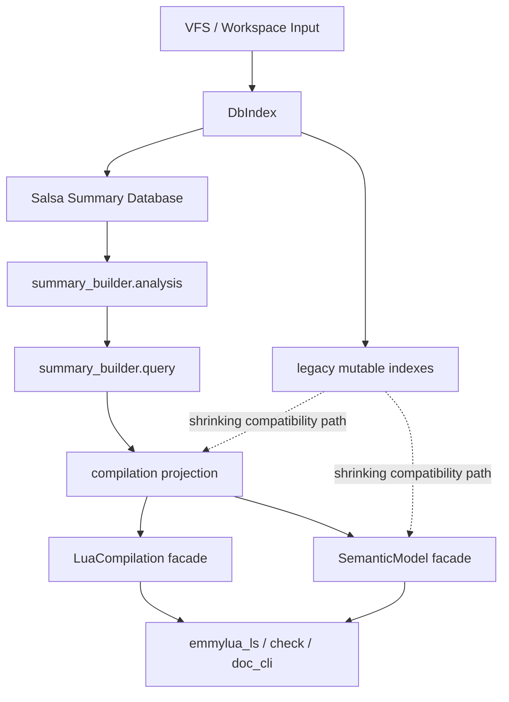

# Compilation / Semantic 架构现状与演进路线

## 目的

这份文档描述 `emmylua_code_analysis` 当前正在形成的架构、已经完成的迁移、仍然保留的 legacy 依赖、后续演进顺序，以及一个最关键的问题：

什么时候可以认为我们已经可以彻底替换掉 analyzer 语义。

这里的“替换 analyzer 语义”不是指删掉一个目录名，而是指：

1. 更新路径不再依赖 analyzer 作为语义事实写入中心。
2. 运行期查询不再依赖 analyzer-era 生成的权威状态才能得到正确答案。
3. 调用者可以通过稳定、集中、内聚的 facade 和 projection API 完成主要工作，而不是直接碰 `DbIndex` 的各类 legacy index。

## 当前架构总览

### 1. `DbIndex`

`DbIndex` 现在仍然是总容器，但目标已经不是“语义事实中心”，而是：

- VFS / workspace / config 的承载体。
- Salsa summary database 的挂载点。
- 少量仍未迁移读路径的兼容承载层。

当前它仍然暴露很多 legacy index：

- `type_index`
- `decl_index`
- `member_index`
- `signature_index`
- `operator_index`
- `reference_index`

这些 index 现在仍被大量 runtime semantic/type-check/query 代码直接访问，所以 `DbIndex` 还没有真正退化成“纯容器”。

### 2. `summary_builder.analysis`

这是 file-local fact layer。

它负责从单文件 AST / doc comment / syntax 中提取事实，不应该承担跨文件语义求值，也不应该继续为 analyzer compatibility 专门写一套平行状态。

这个层的理想产物包括：

- decl tree
- doc summaries
- doc type nodes
- signature summaries
- module export syntax facts
- lexical / flow / property 等局部事实

### 3. `summary_builder.query`

这是 derived query layer。

它的职责是把 file facts 组织成可复用的查询入口和索引结构，而不是让调用者反复扫描 summary 向量。

适合放在这里的东西：

- reverse index
- exact lookup
- graph summaries
- semantic target lookup
- module export resolve query
- signature / generic / owner 相关精确查询

### 4. `compilation`

`compilation` 现在是 migration projection layer，而不是新的 analyzer。

它的职责是：

- 把 summary/query 结果转换成现有调用方可接受的形状。
- 提供过渡期 facade 和 projection API。
- 吸收原来 scattered free-function helper 的聚合责任。

典型代表：

- `LuaCompilation`
- type generic metadata projection
- alias origin projection
- module projection / export projection
- decl / property / super type projection

### 5. `SemanticModel`

`SemanticModel` 是当前面向大部分 runtime consumer 的主入口。

它已经逐步形成了“对单文件语义查询的集中入口”角色，包括：

- module lookup
- module export type lookup
- member lookup
- expr inference
- semantic decl lookup
- type generic metadata facade

但它还没有覆盖所有热点查询。大量内部 semantic 子模块仍然直接读 `DbIndex` 的 legacy index。

### 6. `compilation::analyzer`

`compilation::analyzer` 还存在，而且内部仍然很大。

当前要点不是“它还在，所以架构没变”，而是要分清它剩下的责任：

- 一部分是确实还未迁移走的 update-time 语义写入逻辑。
- 一部分只是被历史路径引用的兼容实现。
- 一部分已经应该移动到 summary fact / query / projection，但还没完全搬完。

也就是说，现在 analyzer 已经不是方向，但它仍然是一个体积很大的历史负担。

## 当前已经完成的关键迁移

### 1. 更新路径已经不是“重跑 analyzer pipeline”主导

`LuaCompilation::update_index()` 当前做的是 summary sync：

- sync summary workspace
- sync summary file

这意味着更新主路径已经开始从“写 legacy index”转向“同步 fact layer”。

这是 analyzer 退场的第一个必要条件，而且已经具备雏形。

### 2. 类型泛型元数据已经有 summary-backed 单一真源

这一块已经完成了本轮最重要的一次收口：

- 新增了 type generic metadata projection。
- `LuaCompilation` / `SemanticModel` 已经有 facade 入口。
- alias origin detailed render 也已经接到 summary-backed projection。
- `emmylua_code_analysis/src` 下不再直接使用 `get_type_index().get_generic_params(...)`。

这件事意义很大，因为它证明了：

- legacy type metadata 可以被 compilation projection 稳定替代。
- summary-first 并不必然损失 runtime 语义质量。
- 一个领域可以先建立单一真源，再逐步迁移 consumer，而不需要中间兼容层横飞。

### 3. 模块查询入口已经开始集中

这轮迁移已经把模块相关读路径收拢成了三层：

- facade：`LuaCompilation` / `SemanticModel`
- internal query 聚合：`module_query`
- low-level implementation：`compilation::module`

已经迁走的内容包括：

- 外部 crate 对模块 lookup / export type 的直接 free-function 调用。
- semantic require/export 若干内部入口。
- member / infer_index / type_check 中的若干 `ModuleRef -> export type` 直读。

这说明“先聚合查询，再上提 facade”这条路是可行的。

### 4. facade API 正在成形，但 crate root 仍然过宽

`LuaCompilation` / `SemanticModel` 已经开始出现真实的集中入口，但 `lib.rs` 仍然在做几乎全量 re-export：

- `pub use compilation::*;`
- `pub use db_index::*;`
- `pub use diagnostic::*;`
- `pub use semantic::*;`
- `pub use vfs::*;`

这意味着架构方向已经对了，但 public surface 还没有真正收住。

### 5. member / decl alias/origin 投影层已建立，读路径开始迁移

本轮迁移 (2026-06-01) 完成了 member 领域的 alias/origin 投影和 consumer 迁移：

**新增 `compilation::member` 投影模块：**

- `get_type_def_kind` — 从 summary DB 查询类型定义的 kind (class/alias/enum/attribute)。
- `type_def_is_class` / `type_def_is_alias` — 对 kind 的便捷 boolean 查询。
- `type_def_alias_origin` — 从 summary DB 解析 alias 的原始类型，不需要 legacy `type_index`。

**consumer 迁移：**

- `semantic/member/find_index.rs` — `find_index_custom_type` / `find_index_generic` 的 alias 检查和 origin 解析迁移到 summary-backed 投影。
- `semantic/member/find_members.rs` — `find_custom_type_members` / `find_generic_members` 的 alias 检查和 origin 解析迁移到 summary-backed 投影。
- `find_generic_members` 删除了对 `type_index.get_type_decl().get_alias_origin()` 的依赖。

**已暴露的 projection API（供后续迁移复用）：**

- `pub(crate) infer_compilation_doc_type_key_with_owner` — 将 doc type key 转换为 `LuaType`，是其他投影的基础构建块。

**当前状态：**

- member 领域 alias/origin 路径已完全脱离 `type_index` 读。
- member/operator dispatch 和 member index 直接读取仍未迁移。
- 38 个 semantic 文件仍保留部分 legacy index 直读，见下一轮迁移计划。

这证明了“先建 projection，再迁 consumer，保留 legacy fallback”的模式可以逐领域推进。

### 6. 本轮迁移记录 (2026-06-01)

**已完成迁移：**

| # | 文件 | 迁移项 |
|---|---|---|
| 1 | `compilation/member.rs` (新增) | `get_type_def_kind`, `type_def_is_class`, `type_def_is_alias`, `type_def_alias_origin`, `type_def_is_enum` — summary-backed 类型查询投影 |
| 2 | `compilation/decl.rs` | `infer_compilation_doc_type_key_with_owner` 从 `fn` 提升为 `pub(crate)` |
| 3 | `semantic/member/find_index.rs` | alias/class 检查 → `type_def_is_alias` / `type_def_is_class` / `type_def_alias_origin`; 删除无用的 `type_decl` 变量 |
| 4 | `semantic/member/find_members.rs` | alias 检查 → `type_def_is_alias` / `type_def_alias_origin`; `find_generic_members` 的 alias origin 从 legacy 迁移 |
| 5 | `semantic/member/infer_raw_member.rs` | `infer_custom_type_raw_member_type`: alias/class/super → summary; `infer_generic_raw_member_type`: alias → summary |
| 6 | `semantic/type_check/simple_type.rs` | generic alias → summary; Ref enum check → `type_def_is_enum` |
| 7 | `semantic/type_check/func_type.rs` | generic alias → summary; custom type class check → `type_def_is_class` |
| 8 | `semantic/type_check/ref_type.rs` | 两处 `is_enum()` → `type_def_is_enum` (fast-fail) |
| 9 | `semantic/type_check/generic_type.rs` | 2 处 alias check + 3 处 super_types → summary-backed |
| 10 | `semantic/type_check/mod.rs` | `escape_type` alias check → summary |
| 11 | `semantic/type_check/complex_type/mod.rs` | generic alias → summary |
| 12 | `semantic/decl/mod.rs` | `enum_variable_is_param` is_enum → `type_def_is_enum` |

**迁移模式总结：**

本轮迁移建立了一个可复用的模式：
1. 为语义领域在 `compilation` 层添加 summary-backed 投影函数（`pub(crate)`）。
2. 语义 consumer 优先使用投影函数，保留 legacy fallback 作为兼容路径。
3. 名称从冗长的 `find_compilation_type_def_*` 简化为 `type_def_*` / `get_type_def_*`。

**剩余工作（Phase 1 继续）：**

- `semantic/infer/infer_name.rs` — `signature_index` / `decl_index`（需 LuaDecl → SalsaDeclSummary 类型迁移）
- `semantic/infer/infer_index/mod.rs` — 13+ `type_index` / `member_index` 直读（最大热点）
- `semantic/infer/infer_call/mod.rs` — `operator_index`
- `semantic/infer/infer_table.rs` — `type_index` / `decl_index`
- `semantic/generic/*` — 多处 mixed access

## 当前最核心的结构性问题

### 问题 1：运行期 semantic 仍然大量直接读取 legacy index

目前最重的未完成问题不是 module path，也不是 generic metadata，而是：

`semantic/**/*` 下仍然存在大量直接访问：

- `db.get_type_index()`
- `db.get_member_index()`
- `db.get_decl_index()`
- `db.get_signature_index()`
- `db.get_operator_index()`

这说明许多 runtime 语义仍然默认 legacy mutable indexes 是权威来源。

只要这件事还成立，就不能说 analyzer 语义已经被彻底替换。

### 问题 2：crate root 对外导出面过宽

当前外部 crate 对 `emmylua_code_analysis` 的使用非常广，直接 import 了很多分散类型和函数：

- `emmylua_ls`
- `emmylua_check`
- `emmylua_doc_cli`

这意味着现在不能直接砍 root re-export，否则会演变成一次大规模外部 API 破坏。

所以 public API 收口必须分阶段完成，而不是“一刀切隐藏一切”。

### 问题 3：analyzer 目录剩余责任还没有被清单化拆分

目前 analyzer 中还混着几类完全不同的东西：

- 真正还没有迁出去的 update-time 语义逻辑。
- 只剩兼容意义的旧实现。
- 本应进入 summary_builder.analysis 的 file-local 提取。
- 本应进入 summary_builder.query 的索引/查询。
- 本应进入 compilation projection 的适配逻辑。

如果不先把这些责任拆清楚，就会很难判断“什么时候 analyzer 可以删”。

## 未来推荐的演化路线

下面这条路线不是抽象路线，而是按当前代码状态排序之后的可执行顺序。

## 第一阶段：继续收读路径，不扩 public breakage

目标：

- 继续减少 `semantic` 对 legacy index 的直接依赖。
- 优先迁移热点读路径到 `summary/query -> compilation projection -> SemanticModel`。
- 尽量不制造外部 crate 的 API break。

优先级建议：

1. generic / type-check / infer / member 的高频读路径。
2. signature / operator / super type / member ownership 等已有 summary/query 雏形的领域。
3. 只在最后处理低频、难迁移的小角落。

这一阶段的原则：

- 不强行一开始就删 `DbIndex` API。
- 先把 consumer 收拢到 facade 或 projection。
- 只有当调用面明显缩小后，再考虑收紧 public surface。

## 第二阶段：把 analyzer 剩余责任按归属拆掉

目标：

- 明确 analyzer 中每个子模块应该迁向哪里。

拆分原则：

- file-local AST/doc 事实提取 -> `summary_builder.analysis`
- indexed / derived / graph / reverse lookup -> `summary_builder.query`
- 调用方兼容形状 -> `compilation`
- 单文件 runtime 查询 -> `SemanticModel`
- 真正只剩历史兼容的部分 -> 直接删除

建议做法：

1. 先为 analyzer 子目录建立责任清单。
2. 每迁完一个子块，就把对应 consumer 切到新路径。
3. 不要维护新的 analyzer-compatible 平行状态。

## 第三阶段：压缩 public API surface

目标：

- 逐步减少 `lib.rs` 的宽泛 root re-export。

但要分层做：

### 3.1 先定义稳定 facade

优先稳定这些入口：

- `EmmyLuaAnalysis`
- `LuaCompilation`
- `SemanticModel`
- 少量明确的 projection data type
- VFS / config / diagnostic 的必要公共类型

### 3.2 再收散装函数和内部实现类型

把下面这些东西优先从“默认公共”变成“按需公开”：

- scattered helper free functions
- 仅内部迁移使用的兼容 projection helper
- legacy index 细节类型

### 3.3 最后才收 `db_index::*`

`db_index::*` 是最危险的一层，因为外部依赖很多。它适合放在最后处理。

## 第四阶段：删除 analyzer 语义

这一步不是“代码量少了很多就删”，而是必须满足明确判定条件。

## 什么时候可以彻底替换掉 analyzer 语义

建议把判定标准分成四组。

### A. 更新路径判定

必须满足：

1. `LuaCompilation::update_index()` 不再依赖 analyzer pipeline 产出权威语义状态。
2. 更新后需要的 file facts 都能从 summary sync 得到。
3. analyzer 即使仍暂时存在，也只剩极小的局部 helper，而不是全局写入中心。

### B. 读路径判定

必须满足：

1. semantic / type_check / infer / diagnostic 的核心热点路径，不再需要 analyzer-era mutable index 才能得到正确结果。
2. generic、module export、member lookup、signature 解释、operator 解释、super type、alias origin 等核心语义都有 summary/query-backed 或 compilation-backed 真源。
3. `semantic/**/*` 中 direct legacy index 读取已经降到“极少数明确、可列举、可替代”的残余点，而不是大面积默认做法。

### C. API 判定

必须满足：

1. 外部 crate 的主要调用路径已经建立在 `EmmyLuaAnalysis` / `LuaCompilation` / `SemanticModel` 上。
2. crate root 不再依赖几乎全量 re-export 来维持可用性。
3. 内部新代码默认不会再把 `DbIndex` 的 legacy indexes 当成第一入口。

### D. 质量判定

必须满足：

1. 当前关键回归测试稳定通过。
2. generic/default/module/member/type-check 等迁移敏感区域的测试覆盖足够。
3. 增量更新性能没有因迁移而明显恶化。
4. 不再出现“summary 有事实，但 consumer 因为还走 legacy 路径看不到”的系统性分裂问题。

## 一个实际可执行的“完成定义”

当以下描述成立时，可以认为 analyzer 语义已经可以被彻底替换：

- 更新主路径只同步 summary facts。
- 核心运行期语义只依赖 summary/query/projection/facade。
- analyzer 中剩余代码已经不再承担 authoritative semantics。
- 删除 analyzer 只会影响少量局部 helper，不会导致全局语义退化。

如果还做不到这一点，就不应该只因为目录名难看而提前删 analyzer。

## 我们这套架构最终的优势会是什么

如果按当前方向推进，这套架构的优势会非常明确。

### 1. 单一真源

同一类语义信息不再分裂在：

- analyzer 写入状态
- runtime 再推一遍
- humanize 再单独解释一遍
- diagnostic 再走另一条兼容逻辑

单一真源的直接收益是：

- 语义一致性更高
- 修 bug 时定位更集中
- 回归范围更可控

### 2. 更好的增量能力

summary fact / query 天然更适合按文件增量重算。

相比 mutation-heavy analyzer pipeline，它更容易做到：

- 变化范围小
- 无关区域少失效
- 查询缓存边界更清晰

### 3. 更强的 API 内聚性

调用方最终只需要理解少量入口：

- `EmmyLuaAnalysis`
- `LuaCompilation`
- `SemanticModel`
- 少量 projection type

而不是记住很多 scattered helper 与 legacy index 组合。

### 4. 更容易测试与替换

summary fact、query、projection、runtime semantic 的边界清楚后：

- 单元测试可以更小、更稳定
- 架构层次更清楚
- 新功能落点更明确
- 删除历史兼容状态时风险更低

### 5. 性能优化会更像“修索引”，而不是“修大流水线”

这是非常重要的长期优势。

一旦 query 层成形，性能优化主要会变成：

- 增加一个更准确的索引
- 为热点增加一个 exact lookup
- 让 stable handle 避免重扫 AST

这比 analyzer 时代那种“大流水线里掺一个局部优化”更可控。

## 接下来建议你自己推进的顺序

如果你接下来自己做，我建议按下面顺序推进。

### 第一优先级

- 继续缩减 `semantic/**/*` 对 `type_index / member_index / decl_index / signature_index / operator_index` 的直接读取。
- 每次只挑一个语义领域，先建立 projection/query 真源，再迁 consumer。

优先领域：

- type check
- infer call / infer name / infer index
- member lookup
- signature explanation / operator dispatch

### 第二优先级

- 给 analyzer 子目录做责任清单。
- 标注每个 analyzer 子块应该迁向 `summary_builder.analysis`、`summary_builder.query`、`compilation` 还是直接删除。

### 第三优先级

- 定义正式 public API 分层。
- 先建立一个“推荐公开面”，不要立刻大砍现有导出。
- 等外部 crate 迁到稳定入口后，再真正压缩 `lib.rs`。

## 当前阶段的判断

到目前为止，可以给出一个明确判断：

- 我们还不能说 analyzer 语义已经可以彻底替换。
- 但更新主路径、类型泛型元数据、模块导出读取路径这几个关键领域已经证明迁移方向是对的。
- 现在最关键的剩余工作不再是“证明 summary-first 可行”，而是系统性减少 runtime semantic 对 legacy index 的默认依赖。

也就是说，方向已经确定，剩下的是执行规模问题，不再是架构可行性问题。

## 简短结论

当前最准确的架构描述是：

- `DbIndex` 是容器和兼容壳。
- `summary_builder.analysis` 是 file-local fact layer。
- `summary_builder.query` 是 reusable query/index layer。
- `compilation` 是 projection / migration layer。
- `LuaCompilation` 和 `SemanticModel` 是未来应该稳定下来的主入口。
- `analyzer` 仍然存在，但它应该被拆解并最终删除，而不是继续作为中心扩展。

真正可以彻底替换 analyzer 语义的时点，不是“文义上看起来差不多”的时候，而是：

- 更新、读路径、API、质量四组判定条件同时满足的时候。

在那之前，最有效的工作方式仍然是：

- 一个领域一个领域地建立单一真源
- 收缩 consumer
- 再删除兼容状态

而不是先大规模重写 analyzer 或先大规模裁 public API。
